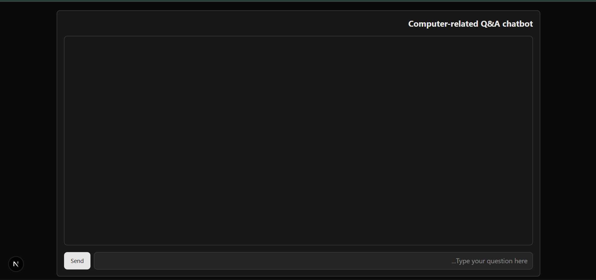

# 🤖 AI Chatbot Project

<div align="center">




### 🚀 A Modern AI Chatbot Built with Next.js + TypeScript + AI SDK

</div>

---

# 📖 Overview

This project is a **modern AI-powered chatbot application** built using **Next.js**, **TypeScript**, and the AI SDK from [ai-sdk.dev](https://ai-sdk.dev).

It demonstrates how to build a real-world conversational AI interface with:

- Clean architecture  
- Streaming responses  
- Fast performance  
- Scalable design  

---

# ✨ Features

## 💬 Chat Features

- Real-time AI responses  
- Streaming chat UI  
- Multi-message conversations  
- Loading & typing indicators  
- Smooth UX experience  

## ⚙️ Technical Features

- Next.js App Router  
- Fully TypeScript-based  
- API Routes / Server Actions  
- Modular architecture  
- Clean code structure  
- Easy AI model integration  

---

# 🧠 Tech Stack

## ⚡ Next.js

Used for:

- Frontend UI  
- Backend API routes  
- Routing system  
- Server-side logic  

---

## 🟦 TypeScript

Provides:

- Type safety  
- Better developer experience  
- Scalable codebase  
- Fewer runtime errors  

---

## 🤖 AI SDK (ai-sdk.dev)

The project uses the AI SDK from:

👉 https://ai-sdk.dev

It provides:

- Simple AI integration  
- Streaming responses  
- Support for multiple LLM providers  
- Clean and unified API  

---


# 🚀 Getting Started

## 1️⃣ Clone the project

```bash
git clone https://github.com/yourusername/ai-chatbot.git
```

---

## 2️⃣ Install dependencies

```bash
npm install
```

---

## 3️⃣ Add environment variables

Create a `.env` file:

```env
OPENAI_API_KEY=your_api_key_here
```

---

## 4️⃣ Run the project

```bash
npm run dev
```

---

# 🔄 How It Works

```
User Input → Next.js API Route → AI SDK → LLM Model → Streaming Response → UI Update
```

---

# 🎨 UI/UX Design

The interface is designed to be:

- Minimal  
- Fast  
- Responsive  
- Mobile-friendly  
- Focused on conversation  

---

# 🧠 What You Will Learn

- AI chatbot architecture  
- Streaming responses  
- Next.js full-stack development  
- AI SDK integration  
- Real-time UI updates  
- Clean project structure  

---

# 🚀 Future Improvements

- Save chat history (database)  
- User authentication  
- Multiple AI models support  
- Voice input/output  
- File upload support  
- Markdown message rendering  
- Chat sharing feature  

---

# ⭐ Why This Project Matters

This project is more than a chatbot.

It is a foundation for building:

- AI SaaS products  
- Customer support bots  
- AI assistants  
- Educational tools  
- Productivity apps  

---

# ❤️ Final Note

This project demonstrates how modern AI applications are built using Next.js and AI SDK with a clean and scalable architecture.

---

<div align="center">

### 🤖 Built with Next.js + TypeScript + AI SDK

Made with ❤️ for developers

</div>